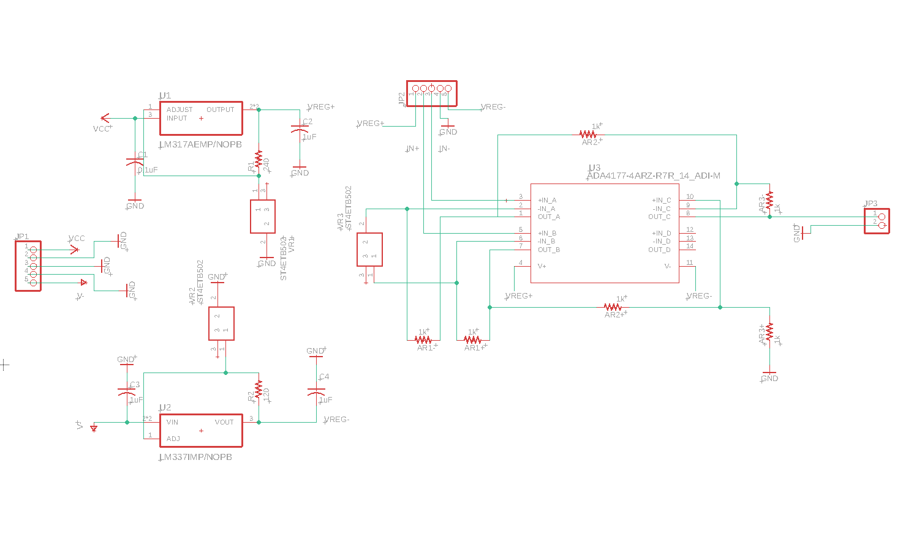
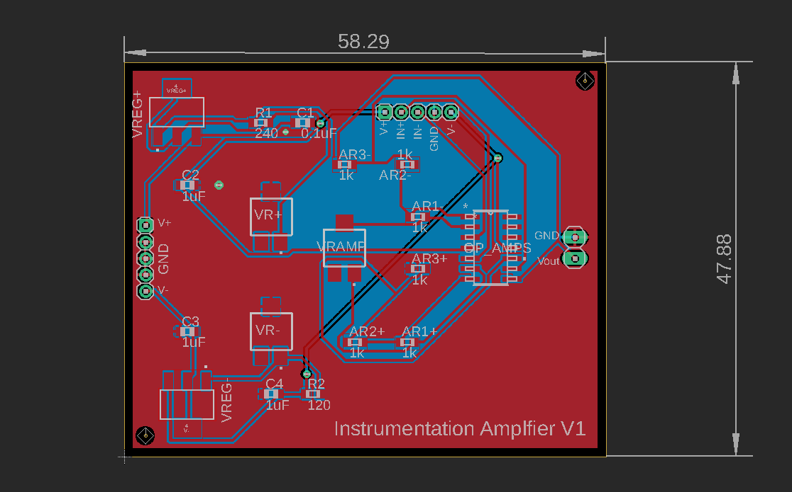

<h1>Instrumentation Amplifier with Regulated Dual Supply</h1>

The instrumentation amplifier uses an adjustable gain differential amplifier with buffered inputs to amplify the readings from an analog sensor using a wheatstone bridge such as a load cell or pressure transducer. The operational amplifiers use a dual power supply which is regulated using variable linear voltage regulators. 

